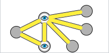
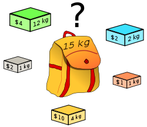
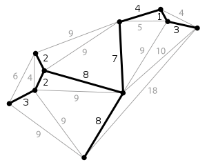
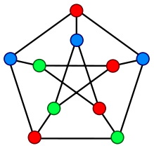
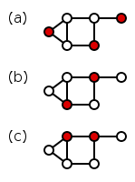

# np-complete-problems

Primer on some NP-Complete problems

- SAT
    - Satisfying boolean variables in conjunctive form to output
    - 3SAT - specific case with 3 literals per clause
- Maximal Independent Set
    - Independent set is anti-clique
    - Set of nodes that aren't connected to each other
    - With MIS no other node can be added to set
- Clique Problem
    - Inverse of independent set
    - In a clique any two distinct nodes are adjacent
- Vertex Cover
    - Minimum set of vertices that are the endpoints of every edge in the graph

    
- Bin Packing Problem
    - Different sized items must be packed into finite number of bins of different sizes
    - Number of bins used to be minimized
- Knapsack Problem
    - Optimize value of given items (weight, value) that can be fit in a knapsack of given weight capacity
    - Combinatorial optimization problem
    
    
- Minimum Spanning Tree
    - Find subset of edges in undirected graph that connects all nodes (spanning tree) with minimum possible edge weight
    - Combinatorial optimization problem
    
    
- Travelling Salesman Problem
    - Visit each node in graph once and return to origin node with shortest path possible
    - Combinatorial optimization problem
- Cutting Stock Problem
    - Cut material into pieces of specified sizes while minimizing material wasted
- Graph Coloring Problem
    - Minimum colors required to color vertices of graph such that no two adjacent vertices are the same color
    
    
- Hamiltonian Path/Cycle Problem
    - Determine whether graph has a Hamiltonian path/cycle (path that visits each vertex exactly once)
- Subset Sum Problem
    - Decision problem to determine whether there exists a subset in the list of integers such that they sum up to a target number *t*
- Optimal Job Scheduling
    - Output schedule optimizing objective function given a list of jobs and machines
    - Scheduling problem
- Set Packing
    - Given a list of subsets and *k*, are there *k* or more subsets that are pairwise disjoint (no two of them share an element)
    - Maximum set packing problem is the optimization version of this
    - Packing problem
- Maximum Coverage Problem
    - Given several sets and a number *k*, select at most k sets such that the maximum number of elements are covered (union of selected sets has maximal size)
    - Weighted version
        - Each element has a weight and task is to find a maximum coverage that has maximum weight
    - Budgeted maximum coverage
        - Along with each element being weighted, there is also a cost associated with each set and a budget given that cannot be exceeded
- Set Cover Problem
    - Given sets whose union equals the universe *S*, pick the smallest number of sets whose union equals the universe
- Dominating Set
    - Subset *D* of graph such that every vertex that is not in *D* is adjacent to at least one member of *D*
    - Very useful in wireless networking
    
    
		